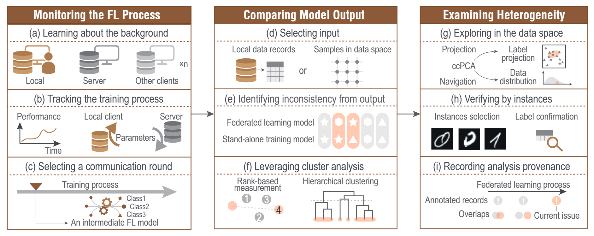
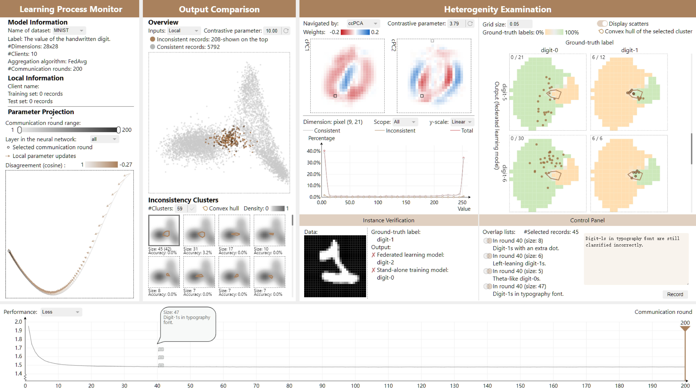

# A Visual System for Identifying Heterogeneity in Federated Learning

Here is the official implementation of system prototype in paper *"A Visual Analysis Approach for Identifying Heterogeneity in Federated Learning"*.

We implemented the frontend and backend seprately. They could be found in the folder [`/Frontend`](Frontend/) and [`/Backend`](./Backend/).

## Description
This is a system designed for a participating client to explore data heterogeneities. 

The system usage can follow the workflow. 

### Workflow
The three-stage workflow for analyzing heterogeneity issues in a federated cooperation from the perspective of a client.

## Screenshot

